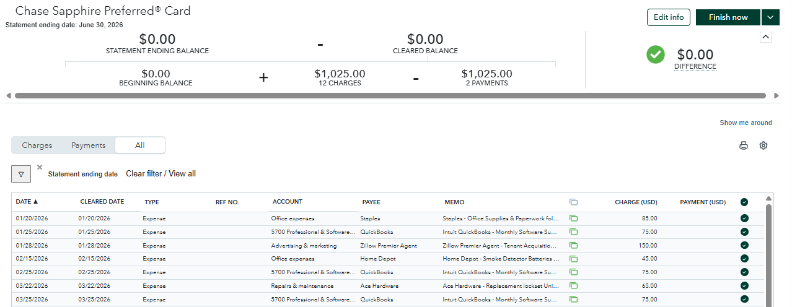

# Real Estate Bookkeeping Portfolio Case Study (QuickBooks Online)

Welcome to my professional real estate bookkeeping portfolio project. This repository contains a comprehensive, end-to-end, 6-month simulated accounting lifecycle for a **4-unit residential rental property** in QuickBooks Online (QBO) [1, 5].

Real estate accounting is highly specialized, requiring strict adherence to trust-fund segregation laws [2], accurate asset capitalization [3], unit-level class tracking [9, 18], and complex journal entries for property acquisitions and disposals [3, 13]. This project serves as a showcase of my ability to maintain clean, audit-ready, and investor-compliant books for real estate professionals globally [1, 15].

---

## 📂 Repository Contents

*   **`real-estate-bookkeeping-portfolio-dataset.xlsx`**: The master Excel workbook containing the complete project data [17].
*   **`Chart_of_Accounts_Import.csv`**: An importable real estate Chart of Accounts with account numbers, types, and detail types mapped for QuickBooks Online [8, 19].
*   **`Checking_Account_Feed.csv`**: A 6-month bank feed (47 transactions) in CSV format ready to import into QuickBooks Online's bank feed tool [12].
*   **`Credit_Card_Feed.csv`**: A 14-transaction credit card registry simulating business overhead and maintenance expenditures [9].
*   **`Readme_&_Portfolio_Guide.pdf`**: A step-by-step masterclass blueprint on how to rebuild this project in your own QBO sandbox [5].

---

## 🏠 Project Scenario: "123 Maple Street"

*   **Property Type**: 4-Unit Residential Apartment Building (Unit A, B, C, and D) [1, 2].
*   **Acquisition Date**: January 15, 2026 [3, 5].
*   **Acquisition Cost**: $850,000 (Allocated: Land $150,000 | Building $700,000) [2, 5].
*   **Financing**: $640,000 Mortgage Loan Payable (6.5% interest, 30-year amortization) [6, 7].
*   **Disposal Date**: June 30, 2026 (Sold for $950,000 with a $40,676.50 capital gain) [1, 5, 13].

---

## 🛠️ Specialized Real Estate Accounting Treatments Showcased

### 1. Land vs. Building Cost Basis Allocation
Buildings depreciate over 27.5 years, but land does not depreciate [2, 20, 21]. Entering the purchase as a single asset is a major tax error. I separated the $850,000 purchase price using a standard 17.65% land allocation ($150,000 Land, $700,000 Building) [2, 3].

### 2. Tenant Escrow Trust Compliance (Zero Co-mingling)
By law, tenant security deposits must be segregated from operational business cash [2]. I established a separate **Tenant Trust checking account** (Asset) to hold the cash and balanced it against a **Tenant Security Deposits Held liability account** [2, 8].

### 3. Class-Based Rental Sub-Ledgers
To evaluate individual unit performance, I configured QBO Class/Location tracking for **Units A, B, C, and D** [9, 10, 22]. Every rent collection and maintenance transaction is tagged to a specific unit, allowing for granular property P&Ls [9, 11].

---

## 📊 Key Property Transactions & Journal Entries

### January 15, 2026: Property Acquisition Journal Entry
To record the property purchase, capitalized acquisition costs, prepaid insurance, mortgage liability, and cash to close from the Closing Disclosure (HUD-1) [3, 4]:

| Account Number | Account Name | Debit | Credit | Description / Memo |
| :--- | :--- | :--- | :--- | :--- |
| **12100** | Fixed Assets: 123 Maple St - Building | $700,000.00 | | Property Acquisition Building Basis [23] |
| **12200** | Fixed Assets: 123 Maple St - Land | $150,000.00 | | Property Acquisition Land Basis [23] |
| **12300** | Fixed Assets: 123 Maple St - Capitalized Costs | $11,000.00 | | Capitalized escrow, title, and lender fees [3] |
| **13100** | Prepaid Property Insurance | $2,400.00 | | 12-month property hazard insurance prepaid at close [15] |
| **23100** | Mortgages Payable: 123 Maple St | | $640,000.00 | Long-Term Commercial Mortgage Loan [6, 8] |
| **31100** | Owner's Capital Investment | | $10,000.00 | Reversing pre-paid earnest money deposit [7, 8] |
| **11100** | Checking - Operating | | $213,400.00 | Final "Cash to Close" wire from operating account [3] |
| **TOTAL** | | **$863,400.00** | **$863,400.00** | **Balanced to the penny** |

### June 30, 2026: Property Disposal Journal Entry
To record the sale of 123 Maple Street for $950,000, payoff of the remaining mortgage, refunding of tenant security deposits, write-off of book value, and booking of the capital gain [1, 13]:

| Account Number | Account Name | Debit | Credit | Description / Memo |
| :--- | :--- | :--- | :--- | :--- |
| **11100** | Checking - Operating | $254,310.00 | | Net sale proceeds wired to operating account [13] |
| **23100** | Mortgages Payable: 123 Maple St | $634,950.00 | | Payoff of the outstanding loan balance [13] |
| **12400** | Accumulated Depreciation: 123 Maple St | $11,676.50 | | Reversing accumulated depreciation to zero [13] |
| **22100** | Tenant Security Deposits Held (Liability) | $7,200.00 | | Refunding deposits to buyer/escrow [8, 13] |
| **12100** | Fixed Assets: 123 Maple St - Building | | $700,000.00 | Writing off building asset basis [13] |
| **12200** | Fixed Assets: 123 Maple St - Land | | $150,000.00 | Writing off land asset basis [13] |
| **12300** | Fixed Assets: 123 Maple St - Capitalized Costs | | $11,000.00 | Writing off capitalized acquisition costs [13] |
| **13100** | Prepaid Property Insurance | | $1,200.00 | Writing off remaining unamortized prepaid insurance [13] |
| **11200** | Checking - Tenant Trust (Security Escrow) | | $7,200.00 | Liquidation of the trust escrow account [13] |
| **52100** | Gain on Sale of Real Estate | | $40,676.50 | Capital gain recorded on property disposal [1, 13] |
| **TOTAL** | | **$908,136.50** | **$908,136.50** | **Balanced to the penny** |

---
## 📊 QuickBooks Online Financial Proof & Visual Evidence

### 📈 Profit & Loss Reports

#### Overall Profit & Loss (Class & Unit Tracking)

#### Profit & Loss (Summary View)

#### Quarterly Profit & Loss Breakdown
| Quarter 1 P&L | Quarter 2 P&L |
| :---: | :---: |
|  |  |

---

### 🏛️ Balance Sheet & Fixed Assets

---

### 📑 Journal Entries (Acquisition & Sale)

#### Property Acquisition Journal Entry ($850,000 Purchase)

#### Property Sale Journal Entry ($950,000 Disposal & Capital Gain)

---

### 🔄 Bank & Credit Card Reconciliations ($0.00 Discrepancy)

#### Checking Account Reconciliation Summary

#### Detailed Bank Reconciliation Statement

#### Credit Card Account Reconciliation

#### Monthly Reconciliation Overview

---

### 👤 Tenant Ledger & Customer Statements

#### Tenant Rent Roll Ledger

#### Tenant Account Status Overview

## 📊 Strategic Financial Ratio & KPI Analysis

Beyond standard record-keeping, providing strategic financial analysis demonstrates high-level advisory value for real estate investors [1]. Below is the ratio analysis generated directly from the property's financial statements:

### 1. Net Operating Income (NOI)
* **Formula**: Gross Operating Revenue − Direct Operating Expenses (excluding mortgage interest and depreciation) [1].
* **Gross Operating Income**: $39,700.00 ($39,600.00 Rental Income + $100.00 Late Fee Income) [2].
* **Direct Operating Expenses**: $10,066.00 ($3,176.00 Property Management + $2,400.00 Property Tax + $1,515.00 Repairs & Maintenance + $2,015.00 Utilities + $450.00 Professional Fees + $380.00 Advertising + $130.00 Office) [2].
* **6-Month Operating NOI**: $29,634.00 ($39,700.00 − $10,066.00) [1, 2].
* **Annualized Operating NOI**: $53,815.00 – $59,268.00 [1, 2].
*(Note: Standard QuickBooks P&L reports list unadjusted Net Operating Income as $2,007.00 because QBO includes non-operating items like mortgage interest of $15,950.00 and depreciation of $11,677.00 under general expense categories [2, 3]).*

### 2. Capitalization Rate (Cap Rate)
* **Formula**: Annualized NOI ÷ Property Purchase Price ($850,000.00) × 100 [1].
* **Calculation**: $53,815.00 ÷ $850,000.00 = **6.33%** (or **6.97%** on unadjusted annualized NOI) [1].
* **Insight**: Demonstrates a strong, healthy unlevered return above typical 5.0%–6.0% market benchmarks [1].

### 3. Debt Service Coverage Ratio (DSCR)
* **Formula**: Annualized NOI ÷ Total Annual Debt Service (Principal + Interest) [1].
* **Annual Debt Service**: $42,000.00 ($21,000.00 6-month debt service) [1, 2].
* **Calculation**: $53,815.00 ÷ $42,000.00 = **1.28** (or **1.41** on unadjusted annualized NOI) [1].
* **Insight**: Comfortably exceeds the standard lender underwriting threshold of **1.25**, proving strong debt coverage for commercial refinancing [1].

### 4. Cash-on-Cash Return (CoC)
* **Formula**: Annualized Pre-Tax Cash Flow (NOI − Debt Service) ÷ Total Cash Equity Invested ($240,000.00) × 100 [1, 4].
* **Annual Pre-Tax Cash Flow**: $53,815.00 − $42,000.00 = $11,815.00 [1, 2].
* **Calculation**: $11,815.00 ÷ $240,000.00 = **4.92%** (or **7.19%** on unadjusted operating cash flow) [1, 2, 4].
* **Insight**: Measures the direct cash yield returned to the investor on their initial $240,000.00 cash capital investment [1, 4].

### 5. Operating Expense Ratio (OER)
* **Formula**: Direct Operating Expenses ÷ Gross Operating Revenue × 100 [1].
* **Calculation**: $10,066.00 ÷ $39,700.00 = **25.36%** [1, 2].
* **Insight**: Indicates exceptional operational efficiency, remaining well below the standard 45.0% industry expense threshold [1].

---

### 📈 KPI Executive Dashboard Summary

| Metric | Property Result | Industry Standard / Target |
| :--- | :---: | :---: |
| **Net Operating Income (NOI)** | **$53,815.00 – $59,268.00** | Positive Operating Cash Flow [1] |
| **Cap Rate** | **6.33% – 6.97%** | 5.0% – 8.0% Market Target [1] |
| **Debt Service Coverage Ratio (DSCR)** | **1.28 – 1.41** | ≥ 1.25 Lender Refinancing Minimum [1] |
| **Cash-on-Cash Return (CoC)** | **4.92% – 7.19%** | 5.0% – 10.0% Target Yield [1] |
| **Operating Expense Ratio (OER)** | **25.36%** | < 45.0% High Operational Efficiency [1] |

## 🏁 How to Verify Your Rebuild (The Answer Key)

If you use the CSV feeds in this repository to reconstruct this client file in QuickBooks Online, your financials must match these exact figures to verify your work [24]:

1.  **Profit & Loss (6-Month Operating)**: Net Operating Income must equal **$2,007.00**; Net Income (including mortgage interest and building depreciation) must equal **$42,684.00** [14].
2.  **Pre-Sale Balance Sheet (June 30 Morning)**:
    *   Total Assets = **$901,884.00** (including $31,284.00 Checking Operating, $7,200.00 Checking Tenant Trust, $1,300.00 Prepaid Insurance, and $861,000.00 Net Fixed Assets) [5].
    *   Total Liabilities = **$645,065.00** (including $634,950.00 Mortgage, $7,200.00 Security Deposits Held, and $415.00.00 Credit Card Payable) [5].
    *   Total Equity = **$277,684.00** (including $240,000.00 Owner Capital and $3,407.50 Net Income) [5].
    *   *Balance Discrepancy = $0.00*
3.  **Post-Sale Balance Sheet (June 30 Evening)**:
    *   Total Assets = **$277,784.00** (fully liquid cash in Checking Operating, after payoff of mortgage, CC, and owner draw of $5,000) [5].
    *   Total Liabilities = **$100.00** (fully liquidated) [5].
    *   Total Equity = **$277,784.00** ($240,000.00 Owner Capital - $5,000.00 Owner Draw + $42,684.00 Cumulative Net Income which includes the $40,677.00 gain on sale) [1, 5, 13].
    *   *Balance Discrepancy = $0.00*

---

## 📩 Contact & Business Inquiries

Are you a real estate investor, property manager, or syndicator looking for a specialized bookkeeper to clean up your books, manage your escrow accounts, and provide executive-level KPI dashboards? [15] 

Let's discuss how I can streamline your bookkeeping so you can focus on scouting your next acquisition [16].

*   **Name**: Mostafa Rafid
*   **Email**: Quickmostafazero@gmail.com
*   **LinkedIn**: https://www.linkedin.com/in/mostafa-rafid-/
*   **Mobile**: +8801781845848
